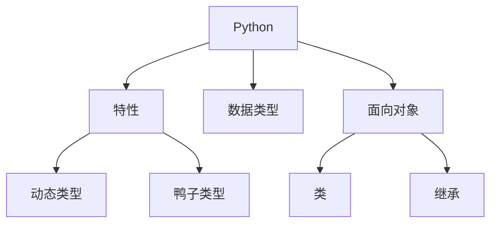

# Python 编程语言

## 概述
Python是一种解释型、高级编程语言，以简洁的语法和丰富的生态系统而闻名。

## 核心特性


## 基础语法
```python
# 变量和数据类型
name = "John"
age = 30
numbers = [1, 2, 3]
person = {"name": "John", "age": 30}

# 函数定义
def greet(name: str) -> str:
    return f"Hello, {name}!"

# 类定义
class Person:
    def __init__(self, name: str):
        self.name = name
    
    def say_hello(self):
        print(f"Hello, I'm {self.name}")

# 上下文管理
with open("file.txt", "r") as f:
    content = f.read()
```

## 高级特性
1. 生成器和迭代器
   ```python
   def fibonacci():
       a, b = 0, 1
       while True:
           yield a
           a, b = b, a + b
   ```

2. 装饰器
   ```python
   def timer(func):
       def wrapper(*args, **kwargs):
           # 计时逻辑
           return func(*args, **kwargs)
       return wrapper
   ```

## 最佳实践
1. 代码风格
   - PEP 8规范
   - 类型注解
   - 文档字符串

2. 性能优化
   - 生成器使用
   - 列表推导式
   - 性能分析

3. 异常处理
   - EAFP原则
   - 上下文管理
   - 错误处理

## 常用库
1. 标准库
   - collections
   - itertools
   - functools

2. 第三方库
   - requests
   - pandas
   - numpy

## 参考资料
1. [Python Documentation](https://docs.python.org/)
2. [Python Style Guide (PEP 8)](https://www.python.org/dev/peps/pep-0008/)
3. [Python Tutorial](https://docs.python.org/3/tutorial/)
