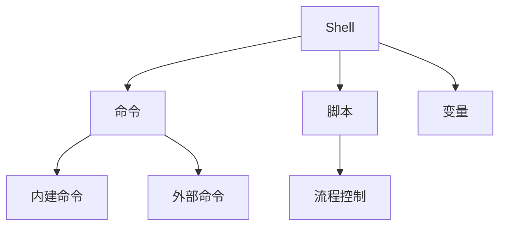

# Shell 脚本编程

## 概述
Shell是一个命令行解释器，它为用户提供了一个界面，用户通过这个界面访问操作系统内核的服务。

## 核心概念


## 基础语法
```bash
#!/bin/bash

# 变量定义和使用
name="John"
echo "Hello, $name"

# 条件判断
if [ -f "file.txt" ]; then
    echo "File exists"
else
    echo "File not found"
fi

# 循环结构
for i in {1..5}; do
    echo "Number: $i"
done

# 函数定义
function greet() {
    echo "Hello, $1!"
}
```

## 常用命令
1. 文件操作
   - ls, cp, mv, rm
   - chmod, chown
   - find, grep

2. 文本处理
   - cat, more, less
   - sed, awk
   - cut, sort

3. 系统管理
   - ps, top
   - df, du
   - netstat

## 最佳实践
1. 脚本规范
   - 清晰的注释
   - 错误处理
   - 日志记录

2. 安全考虑
   - 权限控制
   - 输入验证
   - 环境变量

3. 调试技巧
   - set -x
   - set -e
   - shellcheck

## 常见场景
1. 自动化运维
   - 系统监控
   - 备份脚本
   - 日志处理

2. 开发工具
   - 构建脚本
   - 环境配置
   - 批处理任务

## 参考资料
1. [Bash Reference Manual](https://www.gnu.org/software/bash/manual/)
2. [Advanced Bash-Scripting Guide](https://tldp.org/LDP/abs/html/)
3. [Shell Style Guide](https://google.github.io/styleguide/shellguide.html)
