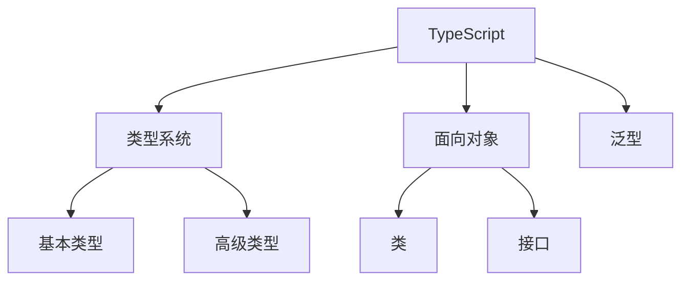

# TypeScript 编程语言

## 概述
TypeScript是JavaScript的超集，添加了可选的静态类型和基于类的面向对象编程。

## 核心概念


## 基础语法
```typescript
// 基本类型
let name: string = 'John';
let age: number = 30;
let isActive: boolean = true;

// 接口定义
interface Person {
    name: string;
    age: number;
    greet(): void;
}

// 类实现
class Employee implements Person {
    constructor(
        public name: string,
        public age: number,
        private salary: number
    ) {}

    greet(): void {
        console.log(`Hello, I'm ${this.name}`);
    }
}

// 泛型使用
function getData<T>(data: T): T {
    return data;
}
```

## 高级特性
1. 类型系统
   - 联合类型
   - 交叉类型
   - 类型推断
   - 类型保护

2. 装饰器
   - 类装饰器
   - 方法装饰器
   - 属性装饰器

3. 模块系统
   - ES模块
   - 命名空间
   - 声明文件

## 工程实践
1. 配置管理
   - tsconfig.json
   - 编译选项
   - 项目引用

2. 类型定义
   - 内置类型
   - 第三方类型
   - 自定义类型

## 最佳实践
1. 类型设计
   - 接口设计
   - 类型组合
   - 泛型约束

2. 性能优化
   - 编译优化
   - 类型检查
   - 代码组织

## 参考资料
1. [TypeScript Documentation](https://www.typescriptlang.org/docs/)
2. [TypeScript Deep Dive](https://basarat.gitbook.io/typescript/)
3. [TypeScript Handbook](https://www.typescriptlang.org/docs/handbook/intro.html)
