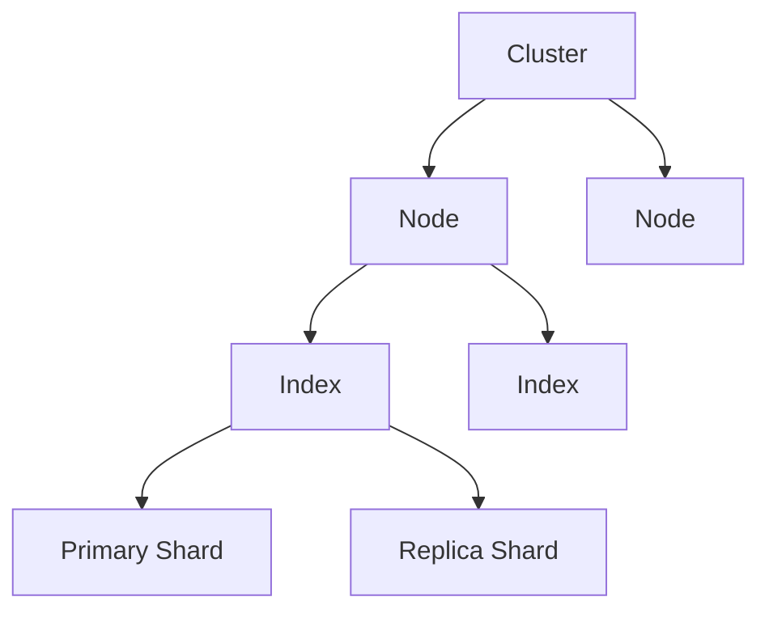

# Elasticsearch 搜索引擎

## 概述
Elasticsearch 是一个分布式、RESTful 风格的搜索和分析引擎，能够解决不断涌现出的各种用例。

## 核心概念


### 基本组件
1. Cluster（集群）
2. Node（节点）
3. Index（索引）
4. Document（文档）
5. Sharding（分片）

## API示例

### 文档操作
```json
// 创建文档
POST /users/_doc
{
  "name": "John Doe",
  "age": 30,
  "interests": ["reading", "music"]
}

// 查询文档
GET /users/_search
{
  "query": {
    "match": {
      "name": "John"
    }
  }
}
```

### 索引管理
```json
// 创建索引
PUT /products
{
  "settings": {
    "number_of_shards": 3,
    "number_of_replicas": 1
  },
  "mappings": {
    "properties": {
      "name": { "type": "text" },
      "price": { "type": "double" },
      "tags": { "type": "keyword" }
    }
  }
}
```

## 主要功能

### 搜索功能
1. 全文搜索
2. 结构化搜索
3. 地理位置搜索
4. 聚合分析

### 高级特性
1. 相关性评分
2. 分词器
3. 同义词
4. 高亮显示

## 最佳实践
1. 索引设计
   - 合理分片
   - 字段类型
   - 分词策略

2. 性能优化
   - 批量操作
   - 查询优化
   - 缓存利用

3. 运维管理
   - 集群规划
   - 监控告警
   - 备份恢复

## 常见问题
1. 内存使用
2. 性能调优
3. 数据一致性
4. 分片失衡

## 运维管理
1. 集群管理
   - 节点配置
   - 角色分配
   - 资源规划

2. 监控指标
   - 集群健康度
   - 节点状态
   - 索引状态

## 参考资料
1. [Elasticsearch Documentation](https://www.elastic.co/guide/index.html)
2. [Elasticsearch: The Definitive Guide](https://www.elastic.co/guide/en/elasticsearch/guide/current/index.html)
3. [Elasticsearch Reference](https://www.elastic.co/guide/en/elasticsearch/reference/current/index.html)
