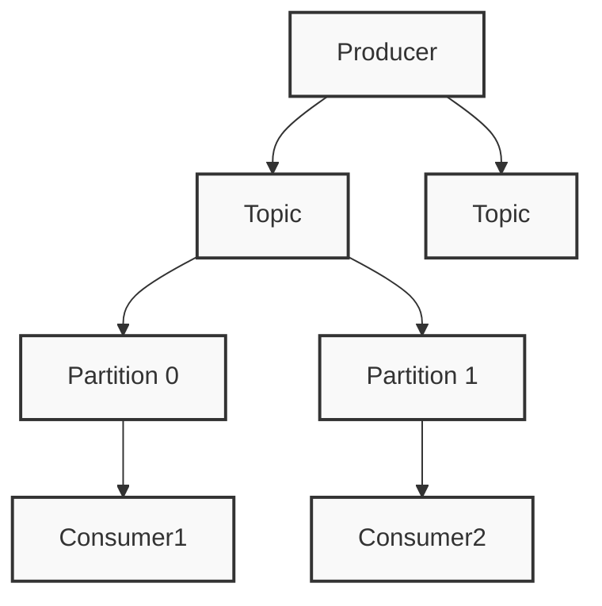

# Apache Kafka 消息队列

## 概述
Kafka 是一个分布式流处理平台，用于构建实时数据流水线和流应用程序。

## 核心概念


### 基本组件
1. Producer（生产者）
2. Topic（主题）
3. Partition（分区）
4. Consumer（消费者）
5. Broker（代理）

## 配置示例
```properties
# 生产者配置
bootstrap.servers=localhost:9092
key.serializer=org.apache.kafka.common.serialization.StringSerializer
value.serializer=org.apache.kafka.common.serialization.StringSerializer
acks=all

# 消费者配置
group.id=my-group
auto.offset.reset=earliest
enable.auto.commit=false
```

## 代码示例
```java
// 生产者示例
Properties props = new Properties();
props.put("bootstrap.servers", "localhost:9092");
props.put("key.serializer", "org.apache.kafka.common.serialization.StringSerializer");
props.put("value.serializer", "org.apache.kafka.common.serialization.StringSerializer");

Producer<String, String> producer = new KafkaProducer<>(props);
producer.send(new ProducerRecord<>("my-topic", "key", "value"));

// 消费者示例
KafkaConsumer<String, String> consumer = new KafkaConsumer<>(props);
consumer.subscribe(Arrays.asList("my-topic"));

while (true) {
    ConsumerRecords<String, String> records = consumer.poll(Duration.ofMillis(100));
    for (ConsumerRecord<String, String> record : records) {
        System.out.printf("offset = %d, key = %s, value = %s%n", 
            record.offset(), record.key(), record.value());
    }
}
```

## 主要特性

### 高可用设计
1. 副本机制
2. Leader选举
3. ISR机制
4. 分区平衡

### 性能优化
1. 批量处理
2. 压缩机制
3. 页缓存
4. 零拷贝

## 最佳实践
1. 主题设计
   - 合理分区数
   - 副本因子
   - 消息格式

2. 生产者配置
   - 批量设置
   - 重试策略
   - 幂等性

3. 消费者优化
   - 分区分配
   - 提交策略
   - 并行处理

## 运维管理
1. 集群监控
   - JMX指标
   - 日志管理
   - 告警配置

2. 扩展方案
   - 集群扩容
   - 分区重分配
   - 迁移方案

## 常见问题
1. 数据丢失
2. 消息积压
3. 性能问题
4. 重复消费

## 参考资料
1. [Apache Kafka Documentation](https://kafka.apache.org/documentation/)
2. [Kafka: The Definitive Guide](https://www.confluent.io/resources/kafka-the-definitive-guide/)
3. [Kafka Best Practices](https://www.confluent.io/blog/apache-kafka-best-practices/)
