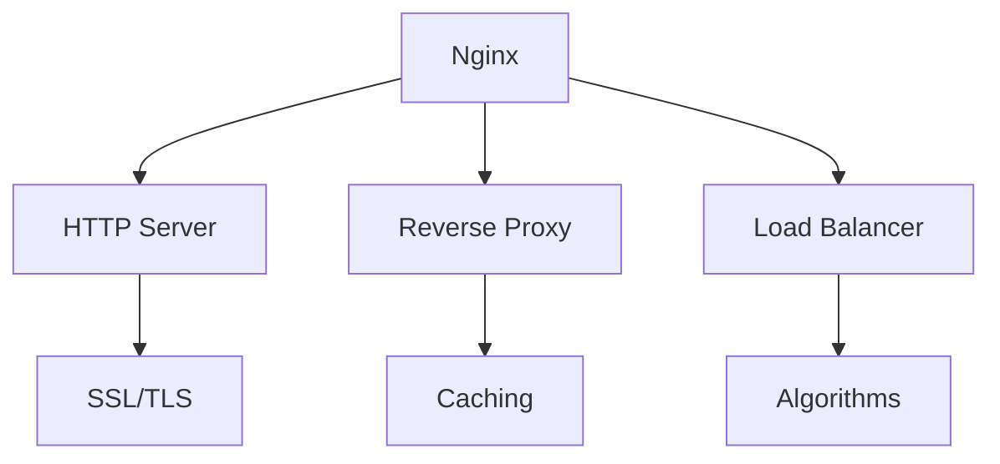

# Nginx 服务器

## 概述
Nginx 是一个高性能的HTTP和反向代理服务器，也是一个IMAP/POP3/SMTP代理服务器。

## 核心功能


## 基础配置
```nginx
# 全局配置
user nginx;
worker_processes auto;
error_log /var/log/nginx/error.log warn;
pid /var/run/nginx.pid;

# 事件模块
events {
    worker_connections 1024;
}

# HTTP模块
http {
    include /etc/nginx/mime.types;
    default_type application/octet-stream;
    
    # 日志格式
    log_format main '$remote_addr - $remote_user [$time_local] "$request" '
                    '$status $body_bytes_sent "$http_referer" '
                    '"$http_user_agent"';
    
    # 虚拟主机
    server {
        listen 80;
        server_name example.com;
        
        location / {
            root /usr/share/nginx/html;
            index index.html;
        }
    }
}
```

## 主要功能

### 反向代理
```nginx
server {
    listen 80;
    server_name api.example.com;
    
    location /api {
        proxy_pass http://backend;
        proxy_set_header Host $host;
        proxy_set_header X-Real-IP $remote_addr;
    }
}
```

### 负载均衡
```nginx
upstream backend {
    least_conn;  # 最少连接数算法
    server backend1.example.com:8080;
    server backend2.example.com:8080;
    server backend3.example.com:8080 backup;
}
```

## 最佳实践
1. 性能优化
   - 开启gzip压缩
   - 配置缓存
   - 启用HTTP/2
   - 优化缓冲区

2. 安全配置
   - SSL/TLS配置
   - 请求限制
   - 访问控制
   - 安全头部

3. 日志管理
   - 日志轮转
   - 错误日志
   - 访问日志
   - 日志格式化

## 常见场景
1. 静态资源服务
2. 反向代理
3. 负载均衡
4. HTTPS配置
5. 缓存服务

## 监控管理
1. 状态监控
   - stub_status
   - 性能指标
   - 连接数监控

2. 日志分析
   - 访问统计
   - 错误分析
   - 性能分析

## 故障排除
1. 常见问题
   - 502错误
   - 504超时
   - 权限问题
   - 配置错误

2. 调试方法
   - 查看日志
   - 测试配置
   - 重载服务

## 参考资料
1. [Nginx Documentation](http://nginx.org/en/docs/)
2. [Nginx Cookbook](https://www.nginx.com/resources/library/complete-nginx-cookbook/)
3. [Digital Ocean Nginx Tutorials](https://www.digitalocean.com/community/tags/nginx)
