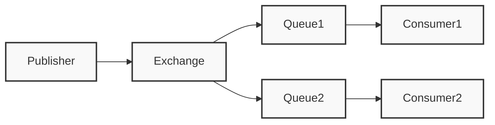

# RabbitMQ 消息队列

## 概述
RabbitMQ 是一个开源的消息代理和队列服务器，用来通过普通协议在完全不同的应用之间共享数据。

## 核心概念


### 基本组件
1. Producer（生产者）
2. Exchange（交换机）
3. Queue（队列）
4. Consumer（消费者）
5. Binding（绑定）

## 交换机类型
1. Direct Exchange
2. Topic Exchange
3. Fanout Exchange
4. Headers Exchange

## 代码示例
```java
// 生产者示例
ConnectionFactory factory = new ConnectionFactory();
factory.setHost("localhost");
try (Connection connection = factory.newConnection();
     Channel channel = connection.createChannel()) {
    
    String message = "Hello World!";
    channel.basicPublish("", "hello", null, message.getBytes());
}

// 消费者示例
DeliverCallback deliverCallback = (consumerTag, delivery) -> {
    String message = new String(delivery.getBody(), "UTF-8");
    System.out.println("Received '" + message + "'");
};
channel.basicConsume("hello", true, deliverCallback, consumerTag -> { });
```

## 消息模式

### 工作队列
```java
channel.basicQos(1); // 公平分发
```

### 发布/订阅
```java
channel.exchangeDeclare("logs", "fanout");
```

### 路由模式
```java
channel.exchangeDeclare("direct_logs", "direct");
```

## 最佳实践
1. 消息可靠性
   - 消息确认
   - 持久化
   - 死信队列

2. 性能优化
   - 预取数量
   - 批量确认
   - 连接池

3. 监控管理
   - 队列监控
   - 消费者监控
   - 延迟监控

## 常见问题
1. 消息丢失
2. 重复消费
3. 消息积压
4. 性能问题

## 高可用配置
1. 集群模式
2. 镜像队列
3. Federation
4. Shovel

## 参考资料
1. [RabbitMQ Documentation](https://www.rabbitmq.com/documentation.html)
2. [RabbitMQ Tutorials](https://www.rabbitmq.com/getstarted.html)
3. [RabbitMQ Best Practices](https://www.cloudamqp.com/blog/part1-rabbitmq-best-practice.html)
