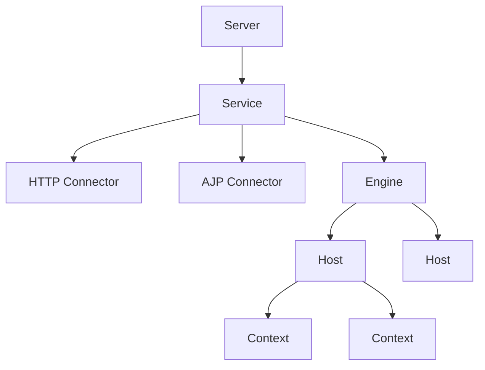

# Apache Tomcat 服务器

## 概述
Tomcat 是一个开源的Java Servlet容器，实现了Java EE的部分规范，包括Java Servlet、JavaServer Pages (JSP)等。

## 核心组件


## 配置示例
```xml
<!-- server.xml -->
<Server port="8005" shutdown="SHUTDOWN">
  <Service name="Catalina">
    <Connector port="8080" protocol="HTTP/1.1"
               connectionTimeout="20000"
               redirectPort="8443" />
               
    <Engine name="Catalina" defaultHost="localhost">
      <Host name="localhost" appBase="webapps"
            unpackWARs="true" autoDeploy="true">
        <Context path="/myapp" docBase="myapp"
                 reloadable="true"/>
      </Host>
    </Engine>
  </Service>
</Server>
```

## 主要特性

### 容器层次
1. Server（服务器）
2. Service（服务）
3. Engine（引擎）
4. Host（虚拟主机）
5. Context（应用上下文）

### 连接器类型
1. HTTP连接器
2. AJP连接器
3. HTTPS配置
4. 代理设置

## 性能优化
1. JVM配置
   - 内存设置
   - GC策略
   - 线程池

2. 连接器优化
   - 线程数
   - 超时设置
   - 缓冲区大小

3. 应用优化
   - 会话管理
   - 类加载
   - 资源缓存

## 安全配置
1. 访问控制
   - 用户认证
   - 角色授权
   - SSL/TLS

2. 安全策略
   - 目录保护
   - 会话安全
   - 漏洞防护

## 监控管理
1. JMX监控
   - 性能指标
   - 资源使用
   - 线程状态

2. 日志配置
   - 访问日志
   - 错误日志
   - GC日志

## 常见问题
1. 启动问题
   - 端口冲突
   - 内存不足
   - 权限问题

2. 运行问题
   - 内存泄漏
   - 连接超时
   - 会话丢失

## 参考资料
1. [Apache Tomcat Documentation](https://tomcat.apache.org/tomcat-9.0-doc/index.html)
2. [Tomcat性能调优](https://tomcat.apache.org/tomcat-9.0-doc/config/host.html)
3. [Tomcat安全配置指南](https://tomcat.apache.org/tomcat-9.0-doc/security-howto.html)
