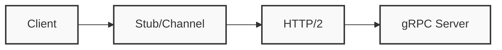

# gRPC 框架

## 概述
gRPC 是一个高性能、开源的RPC框架，使用HTTP/2进行传输，Protocol Buffers作为接口描述语言。

## 核心概念


## 服务定义
```protobuf
syntax = "proto3";

package example;

service UserService {
  rpc GetUser (UserRequest) returns (UserResponse) {}
  rpc ListUsers (ListUsersRequest) returns (stream UserResponse) {}
  rpc UpdateUser (stream UserRequest) returns (UserResponse) {}
  rpc ChatUsers (stream ChatMessage) returns (stream ChatMessage) {}
}

message UserRequest {
  string user_id = 1;
}

message UserResponse {
  string user_id = 1;
  string username = 2;
  string email = 3;
}
```

## 通信模式
1. 一元RPC（Unary）
2. 服务端流式（Server Streaming）
3. 客户端流式（Client Streaming）
4. 双向流式（Bidirectional Streaming）

## 代码示例
```java
// 服务实现
public class UserServiceImpl extends UserServiceGrpc.UserServiceImplBase {
    @Override
    public void getUser(UserRequest request,
                       StreamObserver<UserResponse> responseObserver) {
        UserResponse response = UserResponse.newBuilder()
            .setUserId(request.getUserId())
            .setUsername("John Doe")
            .setEmail("john@example.com")
            .build();
            
        responseObserver.onNext(response);
        responseObserver.onCompleted();
    }
}

// 客户端调用
UserServiceGrpc.UserServiceBlockingStub stub = 
    UserServiceGrpc.newBlockingStub(channel);
UserResponse response = stub.getUser(request);
```

## 主要特性
1. 多语言支持
2. 拦截器机制
3. 负载均衡
4. 安全认证

## 最佳实践
1. 接口设计
   - 版本管理
   - 字段命名
   - 错误处理

2. 性能优化
   - 连接复用
   - 消息大小
   - 流控制

3. 运维管理
   - 健康检查
   - 监控指标
   - 链路追踪

## 常见问题
1. 连接管理
2. 超时处理
3. 错误处理
4. 性能调优

## 参考资料
1. [gRPC Documentation](https://grpc.io/docs/)
2. [Protocol Buffers](https://developers.google.com/protocol-buffers)
3. [gRPC Best Practices](https://grpc.io/docs/guides/performance/)
