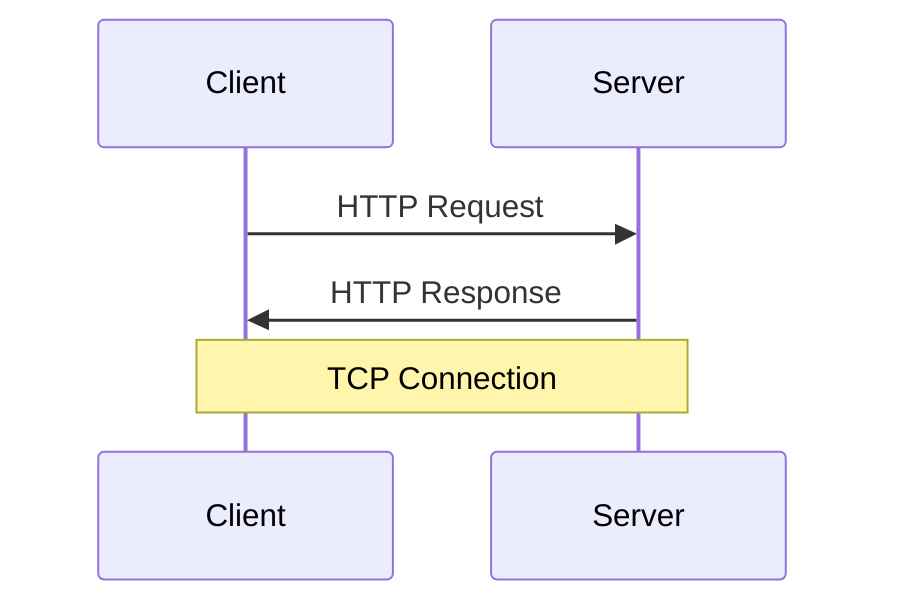

# HTTP 协议

## 概述
HTTP（HyperText Transfer Protocol）是一个用于传输超媒体文档的应用层协议，是互联网数据通信的基础。

## 基本概念


## 请求方法
1. GET
2. POST
3. PUT
4. DELETE
5. HEAD
6. OPTIONS
7. PATCH

## 状态码
- 1xx: 信息响应
- 2xx: 成功响应
- 3xx: 重定向
- 4xx: 客户端错误
- 5xx: 服务器错误

## 请求/响应示例
```http
# 请求
GET /api/users HTTP/1.1
Host: example.com
Accept: application/json
Authorization: Bearer token123

# 响应
HTTP/1.1 200 OK
Content-Type: application/json
Content-Length: 234

{
    "users": [
        {"id": 1, "name": "John"}
    ]
}
```

## 主要特性

### Headers（标头）
1. 通用标头
   - Date
   - Connection
   - Cache-Control

2. 请求标头
   - Accept
   - User-Agent
   - Authorization

3. 响应标头
   - Server
   - Set-Cookie
   - WWW-Authenticate

### Cookie机制
1. 会话管理
2. 个性化设置
3. 跟踪机制

### 缓存控制
1. 强制缓存
2. 协商缓存
3. 缓存策略

## 安全机制
1. HTTPS
   - TLS/SSL
   - 证书体系
   - 加密方式

2. 认证方案
   - Basic
   - Bearer
   - Digest

## 最佳实践
1. RESTful API设计
   - 资源命名
   - 状态码使用
   - 版本控制

2. 性能优化
   - 连接复用
   - 压缩传输
   - 缓存利用

3. 安全考虑
   - XSS防护
   - CSRF防护
   - 请求验证

## 常见问题
1. 跨域问题
2. 性能优化
3. 安全漏洞
4. 缓存问题

## 参考资料
1. [HTTP Documentation](https://developer.mozilla.org/en-US/docs/Web/HTTP)
2. [HTTP/2 Specification](https://http2.github.io/)
3. [RESTful API Design](https://restfulapi.net/)
