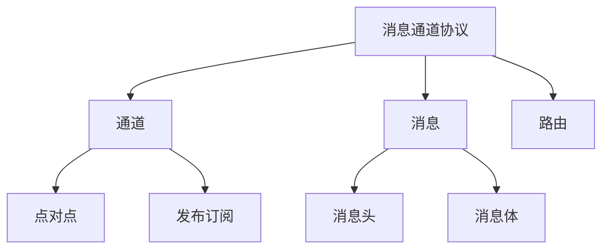

# 消息通道协议 (Message Channel Protocol)

## 概述
消息通道协议（MCP）是一种应用层协议，用于在分布式系统中处理消息的路由、传递和管理。

## 核心概念


## 协议格式
```json
{
    "header": {
        "version": "1.0",
        "messageId": "uuid",
        "channelId": "channel-001",
        "timestamp": 1234567890
    },
    "body": {
        "type": "data",
        "payload": {},
        "encoding": "json"
    }
}
```

## 主要特性
1. 通道管理
   - 通道创建
   - 通道关闭
   - 状态监控

2. 消息处理
   - 消息路由
   - 消息过滤
   - 消息转换

3. 流量控制
   - 限流
   - 背压
   - 负载均衡

## 最佳实践
1. 可靠性保证
   - 消息确认
   - 重试机制
   - 错误处理

2. 安全机制
   - 身份认证
   - 访问控制
   - 加密传输

## 应用场景
1. 微服务通信
2. 事件驱动架构
3. 实时数据处理
4. 分布式系统集成

## 参考资料
1. [AMQP Specification](https://www.amqp.org/specification/1.0/amqp-org-download)
2. [Enterprise Integration Patterns](https://www.enterpriseintegrationpatterns.com/)
3. [Messaging Patterns](https://www.enterpriseintegrationpatterns.com/patterns/messaging/)
