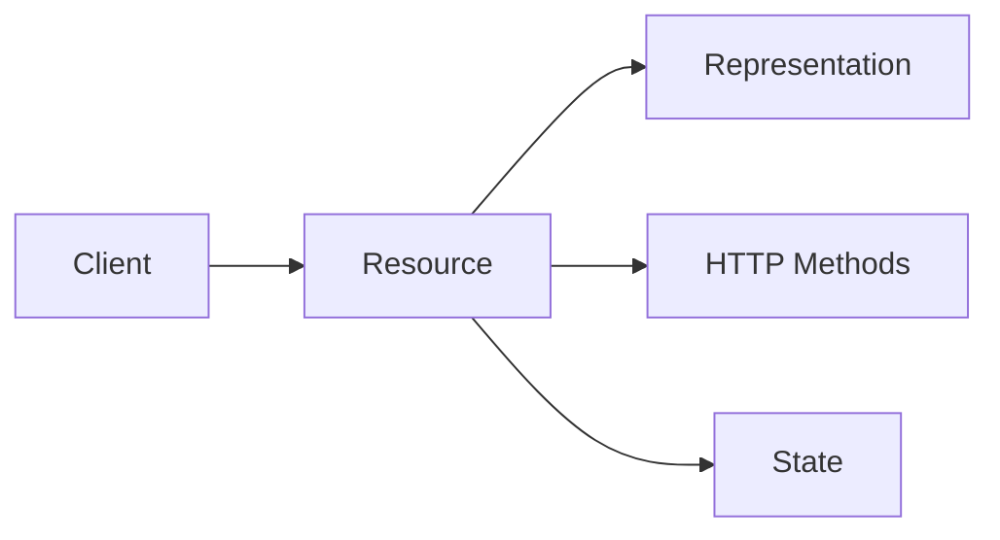

# RESTful API

## 概述
REST (Representational State Transfer) 是一种软件架构风格，用于设计网络应用程序，特别是Web服务。

## 核心概念


## 设计原则
1. 统一接口
2. 无状态
3. 可缓存
4. 客户端-服务器分离
5. 分层系统
6. 按需代码（可选）

## API示例
```http
# 获取用户列表
GET /api/v1/users HTTP/1.1
Host: api.example.com
Accept: application/json

# 创建用户
POST /api/v1/users HTTP/1.1
Content-Type: application/json

{
    "name": "John Doe",
    "email": "john@example.com"
}

# 响应
HTTP/1.1 201 Created
Location: /api/v1/users/123
Content-Type: application/json

{
    "id": "123",
    "name": "John Doe",
    "email": "john@example.com"
}
```

## HTTP方法使用
1. GET：读取资源
2. POST：创建资源
3. PUT：更新资源（全量）
4. PATCH：更新资源（部分）
5. DELETE：删除资源

## 最佳实践
1. URL设计
   - 使用名词而非动词
   - 资源集合用复数
   - 层级关系用/表示

2. 状态码使用
   - 2xx：成功
   - 3xx：重定向
   - 4xx：客户端错误
   - 5xx：服务器错误

3. 版本控制
   - URL版本
   - Header版本
   - Accept头版本

## 安全性考虑
1. 认证方式
   - Basic Auth
   - JWT
   - OAuth 2.0

2. 安全措施
   - HTTPS
   - Rate Limiting
   - CORS策略

## 高级特性
1. HATEOAS
2. 内容协商
3. 缓存控制
4. 条件请求

## 文档规范
1. OpenAPI/Swagger
2. API Blueprint
3. RAML

## 参考资料
1. [REST API Tutorial](https://restfulapi.net/)
2. [Microsoft REST API Guidelines](https://github.com/microsoft/api-guidelines)
3. [RESTful Web Services Cookbook](https://www.oreilly.com/library/view/restful-web-services/9780596809140/)
