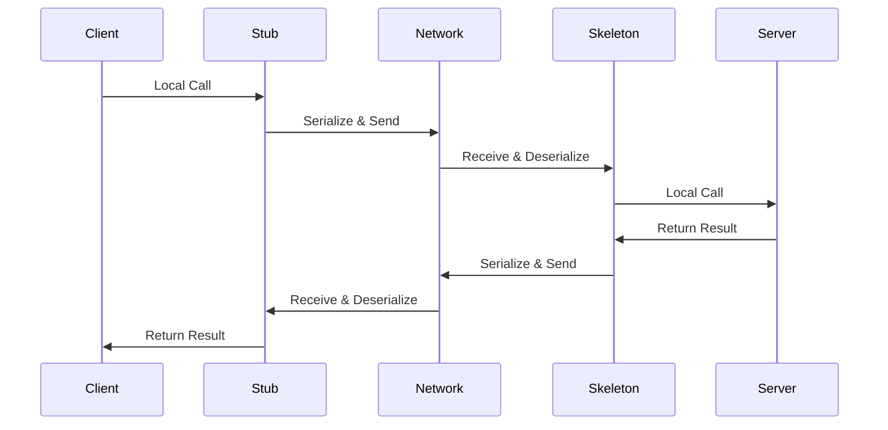

# RPC (Remote Procedure Call)

## 概述
RPC是一种允许程序调用另一个地址空间（通常是在其他计算机上）的函数或方法的协议，就像调用本地函数一样。

## 工作原理


## 核心组件
1. Client/Server
2. Stub/Skeleton
3. Serialization
4. Transport Layer

## 示例代码
```java
// 接口定义
interface UserService {
    User getUser(String userId);
    List<User> listUsers();
}

// 服务实现
class UserServiceImpl implements UserService {
    @Override
    public User getUser(String userId) {
        // 实际业务逻辑
        return userRepository.findById(userId);
    }
}

// 客户端调用
UserService userService = RPCClient.create(UserService.class);
User user = userService.getUser("123");
```

## 主要特性
1. 透明性
   - 像调用本地方法
   - 隐藏网络细节
   - 异常处理

2. 序列化
   - 数据格式
   - 压缩算法
   - 版本兼容

3. 网络传输
   - 连接管理
   - 超时控制
   - 重试机制

## 最佳实践
1. 接口设计
   - 参数限制
   - 异步调用
   - 版本控制

2. 性能优化
   - 连接复用
   - 请求合并
   - 结果缓存

3. 可靠性
   - 熔断降级
   - 负载均衡
   - 服务发现

## 常见问题
1. 网络故障
2. 超时处理
3. 并发控制
4. 版本管理

## 框架对比
1. gRPC
   - Protobuf
   - HTTP/2
   - 跨语言

2. Dubbo
   - Java生态
   - 多协议
   - 服务治理

3. Thrift
   - 跨语言
   - 二进制协议
   - 性能优势

## 参考资料
1. [gRPC Documentation](https://grpc.io/docs/)
2. [Apache Dubbo](https://dubbo.apache.org/en/docs/)
3. [Apache Thrift](https://thrift.apache.org/)
