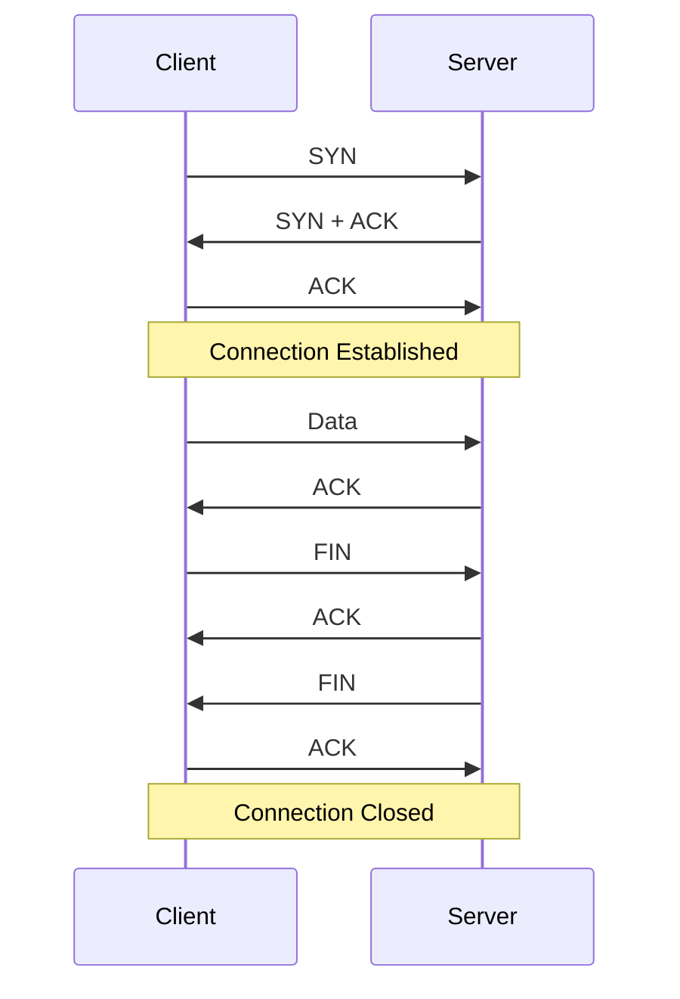

# TCP 协议

## 概述
TCP（Transmission Control Protocol）是一种面向连接的、可靠的、基于字节流的传输层通信协议。

## 工作原理


## 主要特性
1. 面向连接
   - 三次握手
   - 四次挥手
   - 连接状态维护

2. 可靠传输
   - 确认机制
   - 重传机制
   - 流量控制
   - 拥塞控制

3. 数据有序性
   - 序列号
   - 确认号
   - 窗口机制

## 代码示例
```java
// 服务器端
ServerSocket serverSocket = new ServerSocket(8080);
Socket socket = serverSocket.accept();

BufferedReader in = new BufferedReader(
    new InputStreamReader(socket.getInputStream()));
PrintWriter out = new PrintWriter(socket.getOutputStream(), true);

String request = in.readLine();
out.println("Response for: " + request);

// 客户端
Socket socket = new Socket("localhost", 8080);
PrintWriter out = new PrintWriter(socket.getOutputStream(), true);
BufferedReader in = new BufferedReader(
    new InputStreamReader(socket.getInputStream()));

out.println("Hello, Server!");
String response = in.readLine();
```

## 性能优化
1. 连接管理
   - 长连接
   - 连接池
   - 心跳检测

2. 数据传输
   - Nagle算法
   - 延迟确认
   - 窗口扩展

3. 调优参数
   - 缓冲区大小
   - 超时设置
   - 保活选项

## 常见问题
1. 连接问题
   - 连接超时
   - 连接重置
   - 端口耗尽

2. 性能问题
   - 延迟高
   - 吞吐量低
   - 内存占用

## 最佳实践
1. 错误处理
   - 异常捕获
   - 重试机制
   - 优雅关闭

2. 安全考虑
   - SYN攻击防护
   - 加密传输
   - 访问控制

## 参考资料
1. [RFC 793 - TCP](https://tools.ietf.org/html/rfc793)
2. [TCP/IP详解](https://book.douban.com/subject/1088054/)
3. [计算机网络：自顶向下方法](https://book.douban.com/subject/30280001/)
