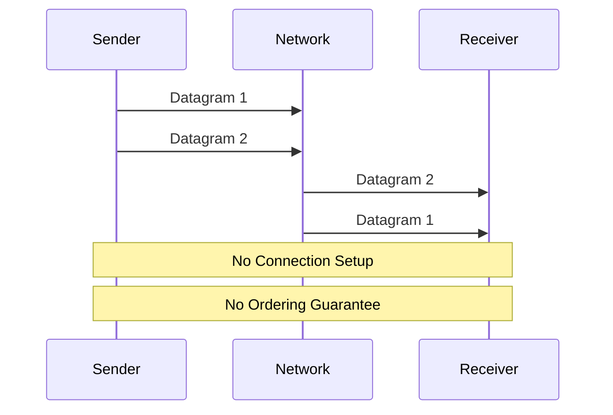

# UDP 协议

## 概述
UDP（User Datagram Protocol）是一种无连接的传输层协议，提供不可靠的数据传输服务。

## 工作原理


## 代码示例
```java
// 服务器端
DatagramSocket serverSocket = new DatagramSocket(9876);
byte[] receiveData = new byte[1024];

while(true) {
    DatagramPacket receivePacket = new DatagramPacket(receiveData, receiveData.length);
    serverSocket.receive(receivePacket);
    String message = new String(receivePacket.getData());
    // 处理接收到的数据
}

// 客户端
DatagramSocket clientSocket = new DatagramSocket();
InetAddress IPAddress = InetAddress.getByName("localhost");
byte[] sendData = "Hello, UDP!".getBytes();

DatagramPacket sendPacket = new DatagramPacket(
    sendData, sendData.length, IPAddress, 9876);
clientSocket.send(sendPacket);
```

## 主要特性
1. 无连接
2. 不可靠传输
3. 高效快速
4. 数据报文格式

## 应用场景
1. 实时应用
   - 视频流
   - 游戏
   - VoIP

2. 简单查询
   - DNS
   - DHCP
   - SNMP

3. 广播/多播
   - 网络发现
   - 流媒体
   - 实时数据分发

## 最佳实践
1. 应用设计
   - 容错处理
   - 数据校验
   - 重传机制

2. 性能优化
   - 缓冲区管理
   - 包大小控制
   - 流量控制

3. 安全考虑
   - 数据验证
   - DDoS防护
   - 加密传输

## 常见问题
1. 数据丢失
2. 数据重复
3. 数据乱序
4. MTU限制

## 参考资料
1. [RFC 768 - UDP](https://tools.ietf.org/html/rfc768)
2. [UDP Protocol Overview](https://www.ietf.org/rfc/rfc768.txt)
3. [Computer Networking: A Top-Down Approach](https://gaia.cs.umass.edu/kurose_ross/index.php)
