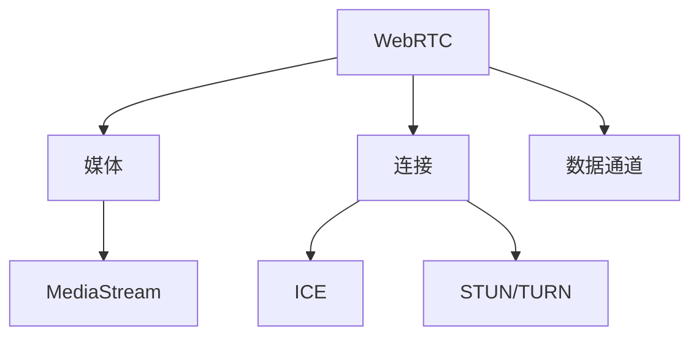

# WebRTC 通信技术

## 概述
WebRTC (Web Real-Time Communication) 是一种支持网页浏览器进行实时语音、视频对话和点对点数据传输的技术。

## 核心组件


## 基础示例
```javascript
// 获取媒体流
async function getMedia() {
    try {
        const stream = await navigator.mediaDevices.getUserMedia({
            audio: true,
            video: true
        });
        videoElement.srcObject = stream;
    } catch (err) {
        console.error(err);
    }
}

// 创建对等连接
const pc = new RTCPeerConnection();

// 添加数据通道
const dataChannel = pc.createDataChannel("chat");
dataChannel.onmessage = e => console.log(e.data);
```

## 主要特性
1. 媒体能力
   - 音频/视频捕获
   - 媒体流处理
   - 编解码支持

2. 网络传输
   - ICE框架
   - NAT穿越
   - 服务器中继

3. 数据通道
   - 点对点传输
   - 可靠/不可靠传输
   - 自定义协议

## 最佳实践
1. 连接建立
   - 信令服务器
   - ICE候选收集
   - 连接协商

2. 媒体处理
   - 适应带宽
   - 质量控制
   - 错误恢复

3. 安全考虑
   - DTLS加密
   - 权限控制
   - 身份验证

## 应用场景
1. 视频会议
2. 在线教育
3. 远程协助
4. 游戏通信

## 参考资料
1. [WebRTC API](https://developer.mozilla.org/en-US/docs/Web/API/WebRTC_API)
2. [WebRTC.org](https://webrtc.org/)
3. [WebRTC Samples](https://webrtc.github.io/samples/)
