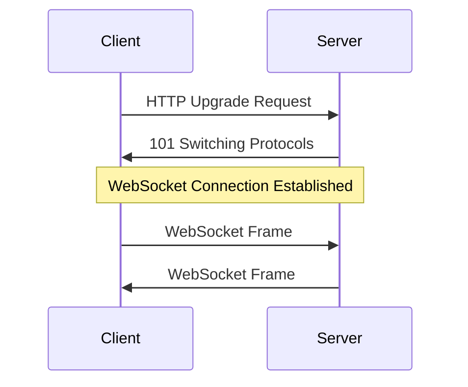

# WebSocket 协议

## 概述
WebSocket 是一种在单个TCP连接上进行全双工通信的协议，它提供了浏览器和服务器之间的双向实时通信能力。

## 工作原理


## 代码示例
```javascript
// 客户端代码
const ws = new WebSocket('ws://localhost:8080');

ws.onopen = () => {
    console.log('Connected to server');
    ws.send('Hello, server!');
};

ws.onmessage = (event) => {
    console.log('Received:', event.data);
};

ws.onclose = () => {
    console.log('Disconnected from server');
};

// 服务端代码 (Node.js)
const WebSocket = require('ws');
const wss = new WebSocket.Server({ port: 8080 });

wss.on('connection', (ws) => {
    ws.on('message', (message) => {
        console.log('Received:', message);
        ws.send(`Server received: ${message}`);
    });
});
```

## 主要特性
1. 全双工通信
2. 低延迟
3. 协议开销小
4. 支持子协议

## 最佳实践
1. 连接管理
   - 心跳检测
   - 自动重连
   - 错误处理

2. 性能优化
   - 消息压缩
   - 批量处理
   - 连接池化

3. 安全考虑
   - WSS加密
   - 身份验证
   - 数据校验

## 应用场景
1. 实时通信
   - 聊天应用
   - 协作工具
   - 在线游戏

2. 数据推送
   - 股票行情
   - 系统监控
   - 消息通知

3. 实时分析
   - 数据可视化
   - 性能监控
   - 日志收集

## 常见问题
1. 连接问题
   - 连接断开
   - 超时处理
   - 代理问题

2. 性能问题
   - 内存泄漏
   - 消息积压
   - 并发处理

## 参考资料
1. [WebSocket API](https://developer.mozilla.org/en-US/docs/Web/API/WebSocket)
2. [WebSocket Protocol](https://tools.ietf.org/html/rfc6455)
3. [WebSocket Guide](https://developer.mozilla.org/en-US/docs/Web/API/WebSockets_API)
