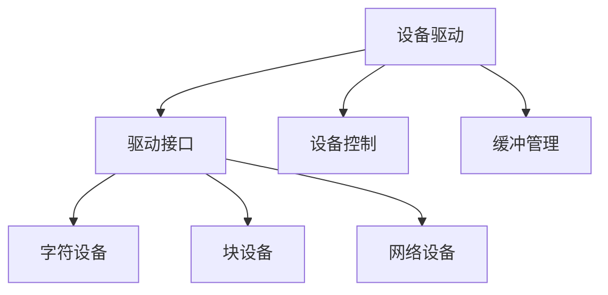

# 设备驱动程序

## 概述
设备驱动程序是操作系统中负责控制特定硬件设备的软件组件，它为应用程序提供统一的接口来访问硬件。

## 核心概念

## 驱动类型
1. 字符设备驱动
   - 串行访问
   - 无缓冲
   - 实时性要求

2. 块设备驱动
   - 随机访问
   - 缓冲管理
   - 数据块传输

3. 网络设备驱动
   - 数据包处理
   - 协议栈接口
   - 网络缓冲区

## 驱动架构
1. 基本结构
   - 初始化接口
   - IO控制接口
   - 中断处理
   - 资源管理

2. 硬件交互
   - 寄存器操作
   - DMA传输
   - 中断处理
   - 总线接口

## 驱动开发
1. 开发流程
   - 硬件分析
   - 接口设计
   - 驱动实现
   - 调试测试

2. 调试技术
   - 日志记录
   - 硬件仿真
   - 错误注入
   - 性能分析

## 最佳实践
1. 错误处理
   - 资源清理
   - 超时处理
   - 异常恢复

2. 性能优化
   - 中断合并
   - 零拷贝
   - DMA使用

## 参考资料
1. [Linux Device Drivers](https://lwn.net/Kernel/LDD3/)
2. [Writing Device Drivers](https://docs.oracle.com/cd/E19683-01/806-5222/)
3. [Windows Driver Development](https://docs.microsoft.com/windows-hardware/drivers/)
