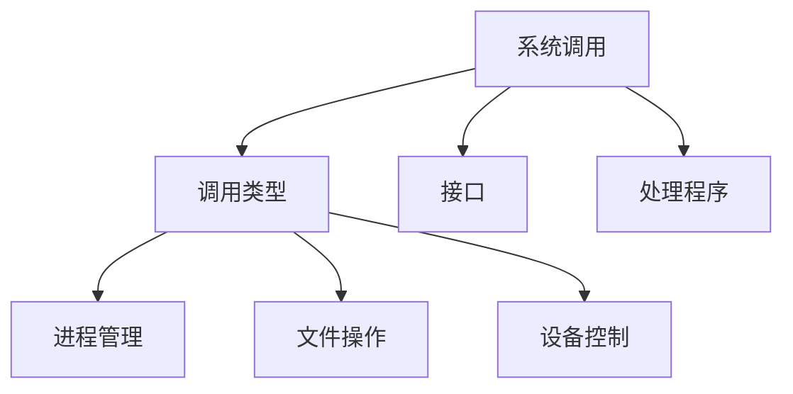

# 系统调用

## 概述
系统调用是操作系统提供给应用程序的接口，允许应用程序访问操作系统内核提供的服务。

## 核心概念

## 主要类型
1. 进程控制
   - fork()
   - exec()
   - exit()
   - wait()

2. 文件操作
   - open()
   - read()
   - write()
   - close()

3. 设备管理
   - ioctl()
   - mmap()
   - select()

## 调用机制
1. 用户态到内核态
   - 陷入指令
   - 参数传递
   - 上下文切换

2. 系统调用处理
   - 参数验证
   - 权限检查
   - 调用分发

## 性能考虑
1. 调用开销
   - 上下文切换
   - 数据复制
   - 中断处理

2. 优化策略
   - 批量操作
   - 缓存机制
   - 异步调用

## 最佳实践
1. 错误处理
   - 返回值检查
   - errno处理
   - 资源清理

2. 性能优化
   - 减少调用次数
   - 使用缓冲
   - 选择合适API

## 参考资料
1. [Operating System Concepts](https://www.os-book.com/OS10/)
2. [Linux System Programming](http://shop.oreilly.com/product/0636920026891.do)
3. [The Linux Programming Interface](https://man7.org/tlpi/)
