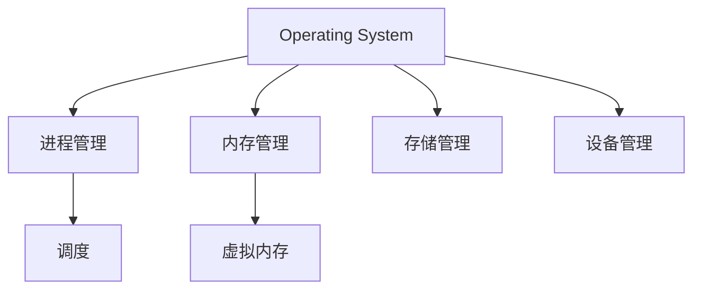

# 操作系统概览

## 核心组件

## 进程管理
1. [进程与线程](./process/process_and_thread.md)
   - 进程控制块
   - 线程管理
   - 上下文切换

2. [进程调度](./process/process_scheduling.md)
   - 调度算法
   - 优先级管理
   - 实时调度

3. [线程调度](./process/thread_scheduling.md)
   - 用户线程
   - 内核线程
   - 线程池

## 内存管理
1. [内存管理系统](./storage/memory_management.md)
   - 地址空间
   - 分页机制
   - 分段机制
   - 虚拟内存

2. 缓存管理
   - 缓存结构
   - 替换策略
   - 一致性维护

## 存储管理
1. [文件系统](./storage/file_system.md)
   - 文件组织
   - 目录结构
   - 存储分配
   - 空间管理

2. 设备管理
   - [驱动程序](./device/device_driver.md)
   - [系统调用](./device/system_call.md)
   - IO调度

## 最佳实践
1. 性能优化
   - 系统调优
   - 资源管理
   - 负载均衡

2. 安全机制
   - 访问控制
   - 权限管理
   - 漏洞防护

## 参考资料
1. [Operating System Concepts](https://www.os-book.com/)
2. [Modern Operating Systems](https://www.pearson.com/us/higher-education/program/Tanenbaum-Modern-Operating-Systems-4th-Edition/PGM80736.html)
3. [Linux Kernel Development](https://www.amazon.com/Linux-Kernel-Development-Robert-Love/dp/0672329468)
