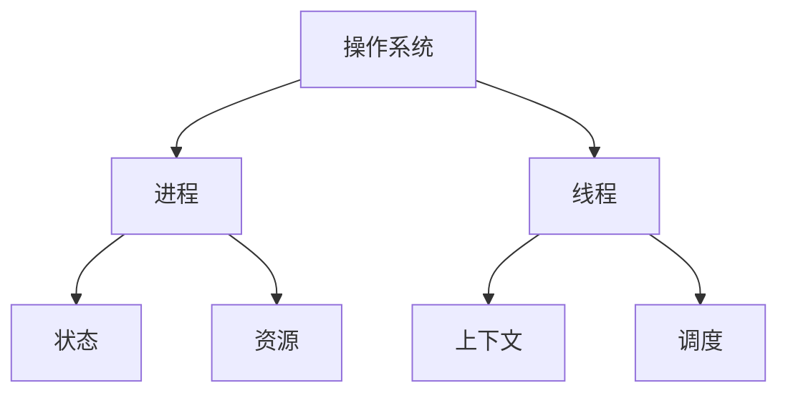

# 进程与线程

## 概述
进程是程序的一次执行实例，是系统资源分配的基本单位；线程是进程中的执行单元，是CPU调度的基本单位。

## 核心概念

## 进程管理
1. 进程状态
   - 创建态
   - 就绪态
   - 运行态
   - 阻塞态
   - 终止态

2. 进程控制块（PCB）
   - 进程标识
   - 处理机状态
   - 进程调度信息
   - 资源清单

## 线程管理
1. 线程类型
   - 用户级线程
   - 内核级线程
   - 混合线程

2. 线程状态
   - 创建
   - 可运行
   - 运行
   - 阻塞
   - 终止

## 进程通信
1. 管道（Pipeline）
2. 消息队列
3. 共享内存
4. 信号量
5. 套接字

## 线程同步
1. 互斥锁
2. 信号量
3. 条件变量
4. 读写锁

## 调度算法
1. 进程调度
   - FCFS
   - SJF
   - 优先级调度
   - 时间片轮转

2. 线程调度
   - 抢占式
   - 非抢占式

## 死锁处理
1. 死锁预防
2. 死锁避免
3. 死锁检测
4. 死锁恢复

## 参考资料
1. [Operating System Concepts](https://www.os-book.com/OS10/)
2. [Modern Operating Systems](https://www.pearson.com/us/higher-education/program/Tanenbaum-Modern-Operating-Systems-4th-Edition/PGM80736.html)
3. [Understanding the Linux Process Management](https://www.kernel.org/doc/html/latest/admin-guide/pm/)
