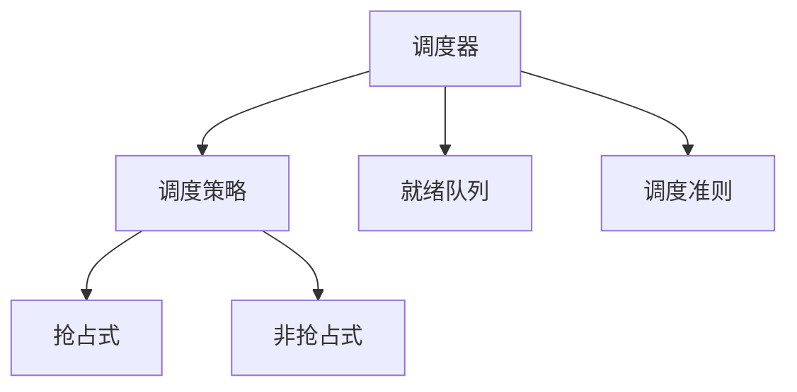

# 进程调度

## 概述
进程调度是操作系统的核心功能之一，负责决定哪个进程获得CPU资源以及分配多长时间。

## 核心概念

## 调度算法
1. 先来先服务（FCFS）
   - 按到达顺序执行
   - 非抢占式
   - 平均等待时间较长

2. 最短作业优先（SJF）
   - 优先执行最短作业
   - 可能导致饥饿
   - 理论上最优

3. 优先级调度
   - 静态优先级
   - 动态优先级
   - 优先级反转

4. 时间片轮转
   - 公平分配CPU
   - 上下文切换开销
   - 时间片大小选择

## 调度准则
1. CPU利用率
2. 吞吐量
3. 周转时间
4. 等待时间
5. 响应时间

## 多级队列
1. 多级反馈队列
   - 动态优先级
   - 多个就绪队列
   - 队列间迁移

2. 公平共享调度
   - 资源配额
   - 组调度
   - 权重分配

## 实时调度
1. 硬实时调度
   - 截止时间保证
   - 任务优先级
   - 资源预留

2. 软实时调度
   - 统计保证
   - 尽力服务
   - 降级策略

## 参考资料
1. [Operating System Concepts](https://www.os-book.com/OS10/)
2. [Real-Time Systems](https://www.pearson.com/us/higher-education/program/Liu-Real-Time-Systems/PGM133681.html)
3. [Linux Process Scheduling](https://www.kernel.org/doc/html/latest/scheduler/sched-design-CFS.html)
