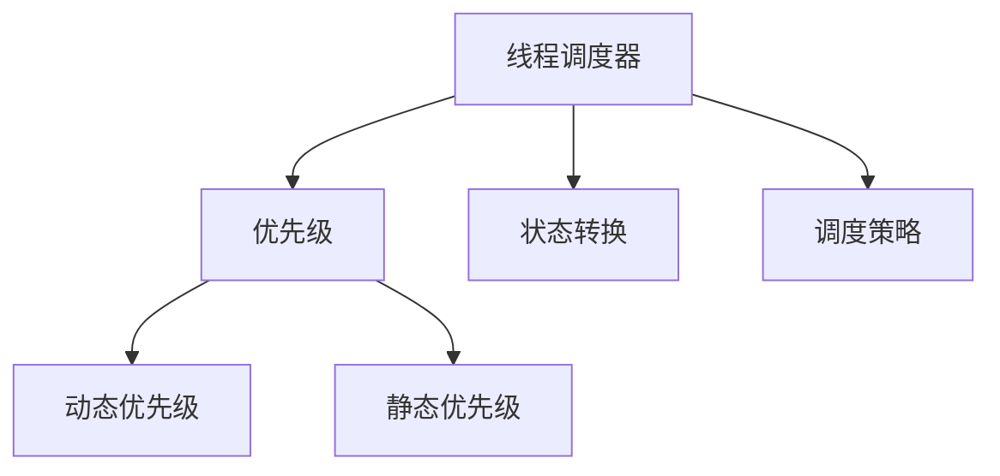

# 线程调度

## 概述
线程调度是操作系统中进行任务调度的基本单位，负责决定哪个线程在什么时候获得CPU资源。

## 核心概念

## 调度策略
1. 用户级线程调度
   - 应用程序控制
   - 轻量级切换
   - 无法利用多处理器

2. 内核级线程调度
   - 操作系统控制
   - 可利用多处理器
   - 切换开销较大

## 调度算法
1. 优先级调度
   - 抢占式优先级
   - 非抢占式优先级
   - 动态优先级调整

2. 公平调度
   - 完全公平调度(CFS)
   - 时间片分配
   - 负载均衡

## 多处理器调度
1. 负载均衡
   - 处理器亲和性
   - 缓存亲和性
   - 负载迁移

2. 调度域
   - NUMA架构
   - CPU组
   - 调度组

## 最佳实践
1. 线程池管理
   - 池大小设置
   - 任务队列
   - 拒绝策略

2. 性能优化
   - 上下文切换
   - 缓存命中
   - 同步开销

## 参考资料
1. [Operating System Concepts](https://www.os-book.com/OS10/)
2. [Linux Kernel Development](https://www.amazon.com/Linux-Kernel-Development-Robert-Love/dp/0672329468)
3. [Java Concurrency in Practice](https://jcip.net/)
