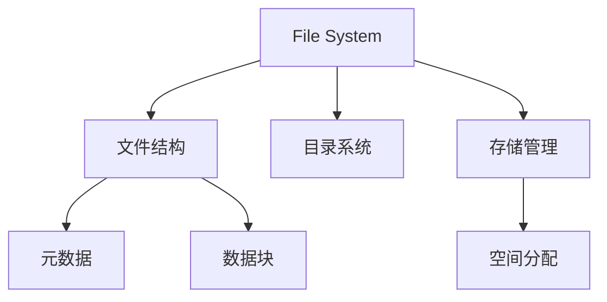

# 文件系统

## 概述
文件系统是操作系统中负责管理和存储文件的系统软件，主要管理文件存储空间的分配，目录维护以及文件存取控制。

## 核心概念

## 基本组成
1. 文件控制块（FCB）
   - 文件属性
   - 访问控制
   - 物理位置

2. 目录结构
   - 单级目录
   - 两级目录
   - 树形目录

3. 存储空间管理
   - 连续分配
   - 链式分配
   - 索引分配

## 常见文件系统
1. Windows
   - FAT32
   - NTFS
   - ReFS

2. Unix/Linux
   - Ext4
   - XFS
   - Btrfs

3. 网络文件系统
   - NFS
   - SMB
   - CIFS

## 关键特性
1. 文件操作
   - 创建/删除
   - 读写访问
   - 定位搜索

2. 空间管理
   - 块分配
   - 空闲管理
   - 碎片整理

3. 安全机制
   - 访问控制
   - 权限管理
   - 加密支持

## 性能优化
1. 缓存机制
   - 页面缓存
   - 目录缓存
   - 元数据缓存

2. IO调度
   - 请求合并
   - 预读取
   - 延迟写入

## 参考资料
1. [Operating System Concepts](https://www.os-book.com/OS10/)
2. [Linux File Systems](https://www.kernel.org/doc/html/latest/filesystems/index.html)
3. [File System Design](https://www.usenix.org/legacy/publications/library/proceedings/usenix2000/general/full_papers/ganger/ganger.pdf)
