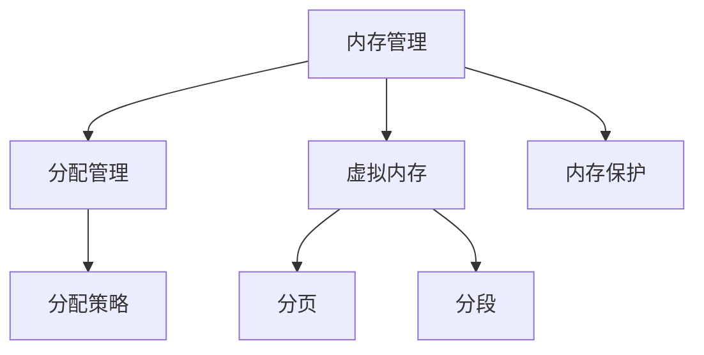

# 内存管理

## 概述
内存管理是操作系统的核心功能之一，负责管理主存储器，包括内存分配、地址转换、内存保护等功能。

## 核心概念

## 内存分配
1. 连续分配
   - 单一连续分配
   - 固定分区分配
   - 动态分区分配

2. 非连续分配
   - 分页
   - 分段
   - 段页式

## 虚拟内存
1. 基本概念
   - 虚拟地址空间
   - 页表管理
   - 地址转换

2. 页面置换
   - FIFO算法
   - LRU算法
   - Clock算法

## 内存保护
1. 地址保护
   - 界限寄存器
   - 基址寄存器
   - 访问权限

2. 共享内存
   - 进程间通信
   - 共享库
   - 写时复制

## 性能优化
1. 缓存管理
   - TLB
   - 缓存一致性
   - 缓存替换

2. 内存碎片
   - 内部碎片
   - 外部碎片
   - 碎片整理

## 参考资料
1. [Operating System Concepts](https://www.os-book.com/OS10/)
2. [Modern Operating Systems](https://www.pearson.com/us/higher-education/program/Tanenbaum-Modern-Operating-Systems-4th-Edition/PGM80736.html)
3. [Understanding the Linux Virtual Memory Manager](https://www.kernel.org/doc/gorman/html/understand/)
