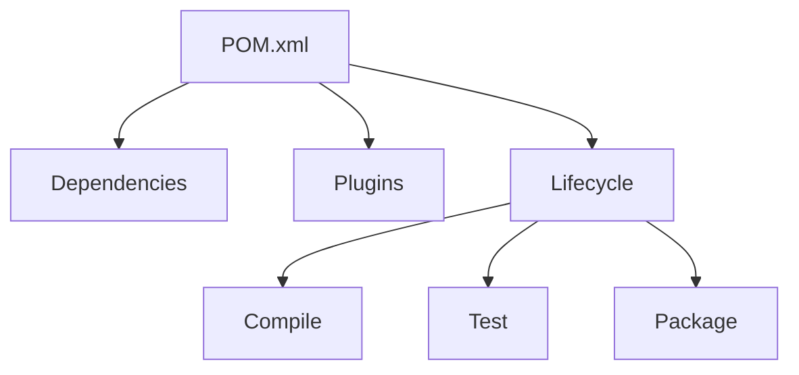

# Maven 构建工具

## 概述
Maven是一个项目管理和构建自动化工具，主要用于Java项目的依赖管理、构建和发布。

## 核心概念


## 项目配置
```xml
<project xmlns="http://maven.apache.org/POM/4.0.0">
    <modelVersion>4.0.0</modelVersion>
    
    <groupId>com.example</groupId>
    <artifactId>demo</artifactId>
    <version>1.0-SNAPSHOT</version>
    
    <dependencies>
        <dependency>
            <groupId>org.springframework.boot</groupId>
            <artifactId>spring-boot-starter-web</artifactId>
            <version>2.7.0</version>
        </dependency>
    </dependencies>
    
    <build>
        <plugins>
            <plugin>
                <groupId>org.springframework.boot</groupId>
                <artifactId>spring-boot-maven-plugin</artifactId>
            </plugin>
        </plugins>
    </build>
</project>
```

## 常用命令
1. 项目构建
   ```bash
   mvn clean install
   mvn package
   mvn compile
   ```

2. 依赖管理
   ```bash
   mvn dependency:tree
   mvn dependency:analyze
   ```

3. 项目创建
   ```bash
   mvn archetype:generate
   ```

## 生命周期
1. clean：清理项目
2. default：构建项目
3. site：生成项目站点

## 最佳实践
1. 依赖管理
   - 版本管理
   - 依赖范围
   - 可选依赖
   
2. 构建配置
   - 资源过滤
   - 编译选项
   - 打包配置

3. 插件使用
   - 常用插件
   - 自定义插件
   - 插件配置

## 常见问题
1. 依赖冲突
2. 构建失败
3. 版本管理
4. 资源处理

## 参考资料
1. [Maven Documentation](https://maven.apache.org/guides/index.html)
2. [Maven in Action](https://www.sonatype.com/products/maven-in-action)
3. [Maven Central Repository](https://search.maven.org/)
